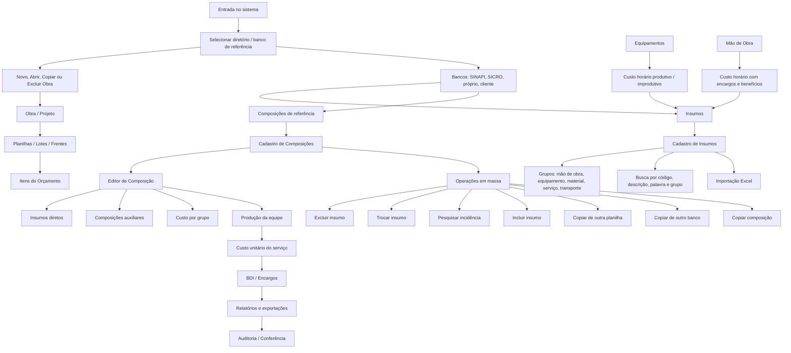

# Estudo de Produto: Núcleo de Orçamento TLPlanly

Data: 02/07/2026  
Foco: transformar o módulo de orçamento em um fluxo profissional, auditável e validado passo a passo, combinando a simplicidade operacional do COMPOR com bons recursos do RM.

## 1. Decisão Estratégica

O melhor caminho não é começar tudo do zero. O projeto já possui base útil de interface, importação, cálculo de custos horários, CPUs e organização visual. A recomendação é criar um "Modo Orçamento" estável, desabilitando ou escondendo o que ainda não foi validado e habilitando uma função por vez, com auditoria, testes operacionais e validação real pelo orçamentista.

A prioridade deve ser:

1. Obra/projeto e lotes/planilhas.
2. Cadastro de insumos manual e por base.
3. Editor de composições no estilo COMPOR.
4. Operações em massa nas composições.
5. Integração com custo horário de equipamentos e mão de obra.
6. Relatórios, exportações e conferência.

O RM serve como referência de completude e visão gerencial, mas a experiência principal deve seguir o COMPOR: direta, rápida, com telas densas, comandos claros e pouca fricção.

## 2. Mapa Visual de Ação

## 3. Repositórios que Podem Cortar Caminho

| Repositório | Como pode ajudar | Risco / cuidado | Decisão recomendada |
|---|---|---|---|
| [OpenConstructionERP](https://github.com/datadrivenconstruction/OpenConstructionERP) | Referência ampla de ERP de construção, BOQ, 5D cost model, catálogos e fluxo de obra. | Licença AGPL-3.0: não copiar código para produto fechado sem análise jurídica/comercial. | Usar como referência de arquitetura, nomenclatura e escopo, não como base direta de código. |
| [OpenConstructionEstimate-DDC-CWICR](https://github.com/datadrivenconstruction/OpenConstructionEstimate-DDC-CWICR) | Estrutura de itens, componentes e recursos de construção; pode inspirar organização de bases. | Dados precisam ser validados para uso no Brasil; checar licença de cada parte. | Bom para estudo de modelo de dados e automação futura. |
| [Tabulator](https://github.com/tabulator-tables/tabulator) | Tabelas densas, edição em linha, filtros, seleção, navegação e visual parecido com sistemas profissionais. | Exige integração cuidadosa com estado atual. | Forte candidato para o editor de composições e listas de insumos. |
| [AG Grid](https://github.com/ag-grid/ag-grid) | Grade muito poderosa para grandes volumes, agrupamento e edição avançada. | Recursos avançados podem exigir licença Enterprise. | Avaliar apenas se Tabulator não suportar as telas críticas. |
| [SheetJS](https://github.com/SheetJS/sheetjs) | Importação/exportação Excel; já combina com a necessidade de importar insumos manualmente. | Conferir limites do build comunitário. | Manter como caminho principal para Excel. |
| [TanStack Table](https://github.com/TanStack/table) | Excelente se o frontend migrar para React/TS; headless e controlável. | Exige reestruturação maior do frontend. | Guardar para uma fase de frontend mais moderno. |
| [HyperFormula](https://github.com/handsontable/hyperformula) | Motor de fórmulas tipo planilha para cálculos complexos. | Licença GPLv3/comercial; cuidado grande. | Usar apenas se houver decisão de licença. Por enquanto, preferir motor próprio simples. |
| [DuckDB-WASM](https://github.com/duckdb/duckdb-wasm) | Consulta local rápida em bases grandes CSV/Parquet/JSON no navegador. | Pode ser excesso no MVP. | Excelente para fase futura de consulta massiva SINAPI/SICRO/local. |
| [TimesFM](https://github.com/google-research/timesfm) | Previsão temporal de preços, tendência de insumos e análise futura. | Não resolve o coração operacional do orçamento. | Deixar para fase analítica depois que orçamento estiver confiável. |

## 4. Modelo de Dados Recomendado

O orçamento precisa ter uma espinha dorsal clara:

| Entidade | Papel |
|---|---|
| Obra / Projeto | Guarda número, nome, cliente, data, status, banco principal e histórico. |
| Planilha / Lote | Representa frente, lote ou planilha dentro da mesma obra. |
| Item de Orçamento | Serviço vendido no orçamento, com quantidade, unidade, composição vinculada e preço. |
| Insumo | Recurso básico: mão de obra, equipamento, material, serviço ou transporte. |
| Composição | Receita técnica do serviço, formada por insumos e composições auxiliares. |
| Recurso da Composição | Linha da composição: código, tipo, índice, quantidade, custo e origem. |
| Banco de Referência | SINAPI, SICRO, banco próprio, banco do cliente ou planilha importada. |
| Equipamento | Dados técnicos e cálculo de custo horário produtivo/improdutivo. |
| Mão de Obra | Salário, encargos, benefícios, horas produtivas e custo horário. |
| Operação em Massa | Exclusão, troca, inclusão, cópia e pesquisa com prévia, confirmação e log. |
| Auditoria | Registro de quem alterou, quando alterou, o que mudou, antes/depois e motivo. |

## 5. Regras de Auditoria e Segurança Operacional

Toda operação que altera várias composições deve ter:

1. Prévia antes de executar.
2. Quantidade de composições afetadas.
3. Lista do que será alterado.
4. Confirmação explícita.
5. Registro em auditoria.
6. Possibilidade de desfazer ou restaurar versão anterior.

Isso é essencial para evitar que uma troca de insumo, exclusão ou cópia em massa destrua um orçamento inteiro sem rastreabilidade.

## 6. Dissertação por Print e Pontos de Implantação

### Print 1: Custos Horários Atuais

A tela atual já tem a intenção correta: separar equipamento por hora e mão de obra por hora. O problema é que ainda parece formulário isolado, não um cadastro conectado ao banco de insumos e às composições. Ela precisa deixar claro que o resultado calculado atualiza o insumo IE ou IH correspondente.

Implantação:

- Transformar código do equipamento/mão de obra em chave vinculada ao cadastro de insumos.
- Ao digitar `IE0001` ou `IH0001`, buscar descrição, unidade, grupo e custo atual.
- Exibir memória de cálculo e permitir salvar o custo no cadastro de insumos.

Melhoria:

- Mostrar produtivo e improdutivo lado a lado.
- Separar parcelas: depreciação, manutenção, material/combustível, mão de obra, juros/impostos quando aplicável.
- Manter visual mais profissional, com grade de parcelas e menos campos soltos.

### Print 2: Constantes K de Depreciação e Manutenção

O COMPOR mostra um ponto importante: manutenção não deve ser apenas um campo manual em reais por hora. Ela pode ser calculada por um fator K, tal como a depreciação, usando valor de aquisição e vida útil. Quanto mais velho ou severo o equipamento, maior o K de manutenção.

Implantação:

- Adicionar `K de manutenção`.
- Calcular manutenção horária a partir de aquisição, vida útil e fator.
- Permitir sobrescrever manualmente em casos específicos.

Melhoria:

- Criar presets por tipo de equipamento: leve, médio, pesado, severo.
- Mostrar alerta quando manutenção calculada estiver fora de faixa usual.

### Print 3: Parcelas Calculadas ou Informadas

Essa opção é decisiva. O sistema precisa aceitar cálculo completo, mas também respeitar o orçamentista que já tem parcelas prontas.

Implantação:

- Modo `Parcelas calculadas`: sistema calcula depreciação, manutenção, material e mão de obra.
- Modo `Parcelas informadas`: usuário informa manualmente cada parcela.
- Modo `Não calcular`: apenas cadastra/consulta.

Melhoria:

- Travar campos incompatíveis com o modo escolhido.
- Registrar no insumo se o custo veio de cálculo ou informação manual.

### Print 4: Parcelas Manuais do Custo Horário

Aqui aparece o detalhe correto das parcelas: depreciação, juros, impostos/seguros, manutenção, material e mão de obra. Essa janela deve virar uma aba ou modal limpo dentro do TLPlanly.

Implantação:

- Criar formulário de parcelas manuais.
- Somar produtivo com todas as parcelas.
- Somar improdutivo sem material e sem manutenção, conforme regra indicada.

Melhoria:

- Exibir memória em formato de tabela.
- Permitir salvar como modelo para equipamentos parecidos.

### Print 5: Insumos do Equipamento

O botão de insumos dentro do equipamento é fundamental. Ele permite compor o custo horário final usando recursos cadastrados, como operador, combustível, aluguel e materiais de desgaste.

Implantação:

- Criar grade de insumos vinculados ao equipamento.
- Digitar apenas código, buscar descrição/unidade/preço automaticamente.
- Informar consumo/índice e calcular total.

Melhoria:

- Permitir `multiplicar pela potência` em casos de energia/combustível.
- Validar se o insumo pertence ao grupo correto.

### Print 6: Código do Equipamento e Busca Automática

O fluxo ideal é: cadastrar o insumo primeiro, depois usar o código no custo horário. O cadastro de equipamento não deve criar uma ilha de dados.

Implantação:

- `IE` identifica equipamento.
- Código busca descrição no cadastro de insumos.
- Salvar custo produtivo no custo unitário e improdutivo no campo próprio do insumo.

Melhoria:

- Mostrar status "insumo encontrado" ou "criar novo insumo".
- Evitar descrição duplicada divergente entre módulos.

### Print 7: Janela de Cálculo do Custo Horário

Essa é a memória de cálculo operacional. O usuário precisa enxergar de onde veio cada número e qual será salvo.

Implantação:

- Modal com parcelas.
- Resumo produtivo/improdutivo.
- Checkbox para atualizar preço do insumo.

Melhoria:

- Botão "salvar memória".
- Comparar custo anterior versus novo custo antes de atualizar.

### Print 8: Mão de Obra com Benefícios

A tela de mão de obra já está no caminho certo. O próximo passo é compor benefícios com insumos próprios: almoço, jantar, alojamento, cesta básica, viagens, transporte.

Implantação:

- Botão "Benefícios".
- Grade de insumos de benefícios com quantidade, frequência, custo unitário e total mensal.
- Retornar total de benefícios para o cálculo da mão de obra.

Melhoria:

- Diferenciar benefício mensal, diário, por hora e por evento.
- Salvar modelos por cargo/função.

### Print 9: Menu Novo Projeto

Esse print define a primeira tela real do orçamento. Antes de qualquer composição, o sistema precisa saber qual obra está sendo orçada.

Implantação:

- Criar obra com número, nome, cliente e data.
- Gerar número automático.
- Opção "mais de uma planilha" para lotes/frentes.

Melhoria:

- Status da obra: rascunho, em revisão, enviada, aprovada, arquivada.
- Campos opcionais: órgão/cliente, cidade, UF, banco base, responsável.

### Print 10: Abrir Projetos

A lista de obras deve ser simples e rápida. O COMPOR mostra uma lista textual, mas no TLPlanly podemos melhorar com busca, filtros e recentes.

Implantação:

- Abrir obra existente.
- Buscar por número, cliente ou palavra.
- Mostrar últimas quatro obras acessadas.
- Permitir excluir obra com confirmação.

Melhoria:

- Filtro por status.
- Ordenação recente/alfabética/número.
- Prévia com cliente, data e valor total.

### Print 11: Cópia de Projetos

Copiar obra semelhante é um grande ganho de produtividade. Muitos orçamentos começam de uma obra parecida.

Implantação:

- Escolher obra origem.
- Criar obra destino com novo número.
- Opção copiar tudo ou apenas estrutura principal.

Melhoria:

- Copiar com atualização de banco de preços.
- Registrar vínculo: "criado a partir da obra X".

### Print 12: Janela Principal da Obra

A janela aberta da obra deve ser o centro operacional. O excesso de menus antigos não deve virar confusão no produto novo.

Implantação:

- Manter foco em Arquivos, Opções, Relatórios, Utilitários e Ajuda.
- No primeiro ciclo, expor apenas o que for validado.

Melhoria:

- Transformar menus em navegação lateral moderna, mas mantendo linguagem conhecida para orçamentista.
- Criar atalhos para Insumos, Composições, Equipamentos e Mão de Obra.

### Print 13: Menu Arquivos com Insumos, Composições, Equipamentos e Mão de Obra

O usuário primeiro sugeriu três itens, depois melhorou para quatro. Essa é a estrutura correta do núcleo.

Implantação:

- Insumos.
- Composições.
- Equipamentos.
- Mão de Obra.

Melhoria:

- Produção da equipe mecânica fica como fase futura.
- Evitar exibir funções sem validação operacional.

### Print 14: Cadastro de Insumos

O cadastro de insumos é a base do sistema. Ele precisa aceitar tanto bases SINAPI/SICRO quanto insumos criados manualmente.

Implantação:

- Código.
- Grupo de insumo.
- Descrição.
- Unidade.
- Custo unitário.
- Custo improdutivo apenas para equipamento.
- Data de preço.

Melhoria:

- Prefixos automáticos: `IH`, `IE`, `IM`, `IS`, `IT`.
- Remover flag percentual.
- Cadastrar manualmente e importar Excel.

### Print 15: Consultas de Insumos

Consulta é produtividade. Um orçamento grande depende de busca rápida e tolerante a erro.

Implantação:

- Buscar por código.
- Buscar por descrição.
- Buscar por palavra.
- Buscar por grupo.

Melhoria:

- Busca sem diferenciar maiúsculas/minúsculas.
- Busca por parte da palavra.
- Resultado em grade com seleção rápida.

### Print 16: Pesquisa por Palavra

O exemplo "TRATOR" mostra a necessidade de busca textual ampla. O usuário não deve precisar saber o código exato.

Implantação:

- Campo de palavra-chave.
- Resultado com todos os insumos que contêm a palavra.
- Opção de pesquisar descrição curta ou completa.

Melhoria:

- Destacar termo encontrado.
- Permitir múltiplas palavras com lógica "e" / "ou".

### Print 17: Login, Plano e Diretório de Trabalho

No beta, a exigência de login foi removida. Para o produto final, o print mostra duas ideias importantes: licenciamento por usuários e seleção de banco/diretório de trabalho.

Implantação futura:

- Login por usuário.
- Controle de plano e expiração.
- Número de usuários por plano.
- Diretório/banco de trabalho selecionável.

Melhoria:

- Não bloquear o beta.
- No MVP, manter seleção de banco dentro das configurações da obra.

### Print 18: Menu Composições

O menu Composições deve centralizar o coração do orçamento. Equipamentos e mão de obra entram como cadastros auxiliares integrados.

Implantação:

- Abrir composições da obra/planilha.
- Criar composição do zero.
- Importar/copiar de banco.
- Editar insumos da composição.

Melhoria:

- Evitar menu "Arquivos" dentro dessa janela se ele apenas duplica atalhos.

### Print 19: Opções da Composição

As opções destacadas formam o pacote profissional que diferencia o sistema: excluir, trocar, pesquisar, incluir e copiar em massa.

Implantação:

- Excluir insumos.
- Trocar insumos.
- Pesquisar incidência.
- Incluir insumos.
- Copiar de outra planilha.
- Copiar de cadastro geral/outro banco.
- Copiar composição.

Melhoria:

- Toda ação deve ter prévia, confirmação e auditoria.

### Print 20: Excluir Insumos

Excluir um insumo de muitas composições é útil e perigoso. Precisa ser uma operação assistida.

Implantação:

- Selecionar insumo.
- Escolher planilha ou projeto.
- Excluir de tudo, faixa ou seleção.
- Excluir insumos sem incidência.

Melhoria:

- Mostrar quantas composições serão afetadas.
- Permitir desfazer.

### Print 21: Excluir por Faixa

A seleção por faixa resolve casos em que apenas parte do orçamento muda.

Implantação:

- Composição inicial.
- Composição final.
- Seleção individual.

Melhoria:

- Grade com checkboxes para seleção alternada.
- Prévia da faixa antes de confirmar.

### Print 22: Trocar Insumos

Troca de insumos é uma das funções mais valiosas. Ela permite alterar estratégia de execução sem reconstruir composições.

Implantação:

- Insumo origem.
- Insumo destino.
- Aplicar a tudo, faixa ou alternados.

Melhoria:

- Preservar índice quando unidade for compatível.
- Alertar quando unidade ou grupo forem diferentes.

### Print 23: Pesquisar Incidência

Essa tela responde a pergunta: onde este insumo está sendo usado e em que quantidade?

Implantação:

- Pesquisar por insumo ou composição.
- Buscar em composições, itens de planilha e auxiliares decompostas.
- Exibir quantidade total consumida.

Melhoria:

- Exportar resultado.
- Abrir composição diretamente a partir do resultado.

### Print 24: Resultado da Pesquisa Decomposta

A pesquisa decomposta é essencial porque um insumo pode não estar direto no serviço principal, mas dentro de uma composição auxiliar.

Implantação:

- Percorrer árvore de composições auxiliares.
- Somar consumo indireto.
- Mostrar caminho: item > composição > auxiliar > insumo.

Melhoria:

- Indicar se a incidência é direta ou indireta.

### Print 25: Incluir Insumos

Essa função resolve inclusão em massa de um recurso novo, como novo equipamento, insumo de segurança ou custo adicional.

Implantação:

- Selecionar insumo.
- Informar incidência.
- Aplicar por planilha/projeto, por item/composição, faixa ou alternados.

Melhoria:

- Evitar duplicar insumo se já existir na composição.
- Permitir somar índice ou substituir índice existente.

### Print 26: Copiar de Outra Planilha

Muitas composições são específicas de uma obra. Copiar de outra planilha evita perder conhecimento já ajustado.

Implantação:

- Selecionar planilha origem.
- Copiar uma composição ou faixa.
- Definir novo código quando necessário.

Melhoria:

- Detectar conflitos de código.
- Permitir substituir ou criar cópia com novo código.

### Print 27: Copiar de Outro Banco

Clientes privados podem misturar bases. O sistema precisa aceitar mais de um banco, sem prender o orçamento em uma única origem.

Implantação:

- Escolher banco externo.
- Copiar composição ou faixa.
- Reclassificar/recodificar insumos quando necessário.

Melhoria:

- Registrar origem da composição.
- Avisar quando insumos do banco externo não existem no banco atual.

### Print 28: Copiar Composição

Copiar uma composição para outra nova é recurso diário de orçamento. O exemplo do concreto é perfeito: muda o traço, mas a estrutura base é parecida.

Implantação:

- Origem.
- Destino.
- Novo código e descrição.
- Copiar insumos e índices.

Melhoria:

- Abrir automaticamente a nova composição para ajuste.

### Print 29: Botão Insumos da Composição

Esse botão entra na composição de fato. Ele deve ser um dos fluxos mais bem desenhados do sistema.

Implantação:

- Abrir editor de recursos da composição.
- Mostrar insumos diretos e composições auxiliares.

Melhoria:

- Manter contexto da composição aberta.
- Salvar rascunho antes de entrar no detalhe.

### Print 30: Editor de Insumos da Composição

Aqui aparece a essência do COMPOR: uma grade direta, com código, descrição, unidade, índice, improdutivo, quantidade, total e total por produção.

Implantação:

- Grade editável.
- Inclusão por código, descrição ou palavra.
- Separar insumo e composição auxiliar.
- Calcular totais por linha.

Melhoria:

- Usar Tabulator ou grade equivalente.
- Teclas rápidas para orçamentista trabalhar sem mouse.

### Print 31: Entrar e Sair de Composição Auxiliar

As setas permitem navegar na árvore da composição sem perder a linha de raciocínio.

Implantação:

- Entrar na composição auxiliar selecionada.
- Voltar para a composição anterior.
- Breadcrumb mostrando o caminho.

Melhoria:

- Mostrar alerta se a composição auxiliar foi alterada e impacta outras composições.

### Print 32: Visão da Composição Auxiliar

A composição auxiliar deve ter a mesma experiência da composição principal, mas deixando claro que é auxiliar.

Implantação:

- Título com código e descrição.
- Custo unitário próprio.
- Lista de recursos internos.

Melhoria:

- Indicar onde essa auxiliar é usada.

### Print 33: Custo Unitário por Grupo e Produção da Equipe

Esse é o coração do orçamento. O custo precisa ser separado por grupo para conferência: equipamentos, mão de obra, materiais, serviços terceiros, auxiliares e transporte. A produção da equipe altera principalmente equipamento e mão de obra, e define o custo unitário final do serviço.

Implantação:

- Calcular subtotais por grupo.
- Calcular custo total.
- Aplicar produção da equipe.
- Exibir preço unitário final.

Melhoria:

- Mostrar comparativo antes/depois quando produção muda.
- Destacar grupos que mais pesam no custo.
- Permitir auditoria de cada número até o insumo original.

### Print 34: Composição do RM

O RM demonstra maturidade de grade, abas e painel lateral, mas é mais carregado. Para o TLPlanly, o ideal é absorver a clareza gerencial sem perder a simplicidade do COMPOR.

Implantação:

- Painel lateral opcional com resumo.
- Abas apenas quando agregarem valor.
- Grade central como área principal.

Melhoria:

- Interface mais limpa, moderna e objetiva.
- Evitar excesso de campos e janelas simultâneas.

## 7. Plano de Implantação por Fases

### Fase 0: Congelamento e Validação do Núcleo

Objetivo: esconder recursos instáveis e focar apenas em orçamento.

Entregas:

- Criar modo "Orçamento".
- Inventariar funções existentes.
- Marcar funções como validada, beta ou oculta.
- Criar checklist operacional de validação.

### Fase 1: Obra, Planilhas e Cópia

Objetivo: estruturar a entrada do orçamento.

Entregas:

- Novo projeto/obra.
- Abrir projeto.
- Copiar projeto.
- Excluir projeto.
- Últimos quatro projetos.
- Planilhas/lotes/frentes dentro da obra.

### Fase 2: Insumos Profissionais

Objetivo: transformar insumos em cadastro confiável.

Entregas:

- Cadastro manual.
- Importação Excel.
- Grupo de insumo.
- Prefixos automáticos.
- Busca por código, descrição, palavra e grupo.
- Custo improdutivo só para equipamento.

### Fase 3: Equipamentos e Mão de Obra Integrados

Objetivo: ligar os cálculos horários ao cadastro de insumos.

Entregas:

- Custo horário de equipamento com K de manutenção.
- Parcelas calculadas/informadas.
- Insumos do equipamento.
- Custo produtivo/improdutivo.
- Custo de mão de obra com benefícios compostos.
- Atualização automática de IE/IH no cadastro de insumos.

### Fase 4: Editor de Composições Estilo COMPOR

Objetivo: criar o coração do orçamento.

Entregas:

- Cadastro de composição.
- Grade de insumos e auxiliares.
- Custo por grupo.
- Produção da equipe.
- Cálculo do custo unitário.
- Navegação em composições auxiliares.

### Fase 5: Operações em Massa

Objetivo: dar produtividade e controle ao orçamentista.

Entregas:

- Excluir insumo.
- Trocar insumo.
- Pesquisar incidência.
- Incluir insumo.
- Copiar de outra planilha.
- Copiar de outro banco.
- Copiar composição.
- Prévia, confirmação, auditoria e desfazer.

### Fase 6: Bancos de Referência

Objetivo: permitir SINAPI, SICRO, banco próprio e banco de cliente.

Entregas:

- Cadastro de bancos.
- Seleção por obra.
- Importação/consulta.
- Origem rastreável de insumos e composições.

### Fase 7: Relatórios e Conferência

Objetivo: entregar orçamento auditável.

Entregas:

- Memória de cálculo.
- Curva ABC.
- Lista de insumos.
- Composições analíticas.
- Exportação Excel/PDF.
- Relatório de alterações.

## 8. Melhorias de Interface

Direção visual:

- Menos cara de formulário solto, mais cara de ferramenta profissional.
- Telas densas, mas organizadas.
- Grades fortes para insumos e composições.
- Botões com ícones e rótulos curtos.
- Painel de resumo sempre visível nas telas críticas.
- Cores sóbrias, com amarelo/laranja da marca usado para ação principal.
- Evitar cards decorativos em excesso nas áreas operacionais.

Padrão recomendado:

- Página principal da obra com navegação lateral.
- Módulos em abas ou segmentos: Itens, Insumos, Composições, Equipamentos, Mão de Obra.
- Editor de composição com grade central e resumo lateral/superior.
- Modais apenas para confirmação, cópia, troca e seleção avançada.

## 9. O Que Não Deve Entrar Agora

Para evitar repetir as falhas operacionais, estes pontos devem ficar fora do primeiro ciclo:

- Produção da equipe mecânica completa.
- IA preditiva de preços.
- TimesFM.
- BIM/CAD/takeoff.
- Licenciamento e cobrança.
- Controle completo de usuários.
- Planejamento/cronograma/medição.
- Relatórios sofisticados antes do cálculo estar validado.

## 10. Critérios de Sucesso

O núcleo de orçamento estará pronto quando:

1. Uma obra puder ser criada, copiada, aberta e organizada por lote.
2. Insumos puderem ser cadastrados manualmente e importados por Excel.
3. Uma composição puder ser criada do zero.
4. Uma composição puder usar insumos e composições auxiliares.
5. O custo unitário for calculado por grupo e produção.
6. Equipamento e mão de obra atualizarem seus insumos automaticamente.
7. Operações em massa tiverem prévia e auditoria.
8. O orçamentista conseguir conferir o número final sem perguntar "de onde veio isso?".

## 11. Síntese Executiva

O produto deve nascer como um sistema de orçamento, não como um ERP completo. A vantagem competitiva está em unir:

- simplicidade operacional do COMPOR;
- clareza de custo por grupo;
- cadastro manual e importação flexível;
- integração entre insumos, equipamentos, mão de obra e composições;
- operações em massa com segurança;
- auditoria completa.

O caminho mais seguro é evoluir o repositório atual, mas redesenhar o núcleo do orçamento como um módulo validado, profissional e progressivo. O ponto central não é ter muitas funções, e sim ter poucas funções essenciais que funcionam com confiança em orçamento real.
