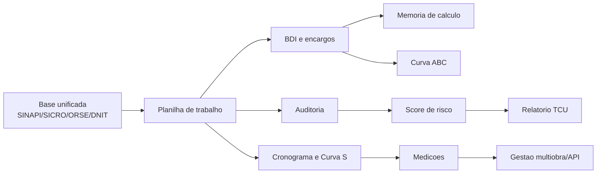

# TLPlanly - Mapa das 3 fases implementadas

Data: 2026-05-30
Projeto: `C:\Users\CARLOS ALBERTO\PROJETOS CARLÃO\orcamentos_sinapi`
Tela principal: `tlplanly.html`

## Norte do produto

O TLPlanly agora segue dois modos de operacao no mesmo fluxo:

- Construtor: montar, ajustar, calcular e exportar planilhas orcamentarias.
- Auditor: conferir preco, desconto real, risco, conformidade TCU e execucao.

Frase de posicionamento: o sistema nao apenas monta o orcamento; ele prova, rastreia e fiscaliza o orcamento.

## Fase 1 - Core de orcamentacao e conferencia

Entregas implementadas:

- Elaboracao de orcamento por base unificada.
- Bases suportadas na interface: SINAPI real local, SICRO, ORSE e DNIT como camada de referencia complementar.
- Inclusao de itens na planilha diretamente pela busca de referencias.
- Edicao de quantidade, unidade, descricao e preco unitario.
- Calculo automatico de custo direto, encargos, BDI e total final.
- BDI com formula do Decreto 7.983/2013.
- Perfis separados de BDI para servicos e materiais/equipamentos.
- Encargos sociais em regime nao desonerado e desonerado.
- Curva ABC automatica por impacto financeiro.
- Memoria de calculo exportavel em CSV e TXT.
- Exportacao da planilha de trabalho em CSV.

## Fase 2 - Inteligencia de auditoria

Entregas implementadas:

- Auditoria contra base unificada, nao apenas contra codigo SINAPI.
- Correspondencia por codigo quando existe referencia direta.
- Fuzzy match por descricao quando o codigo nao bate, com indice de confianca.
- Score de risco por item.
- Combinacao de criterios: diferenca de preco, classe ABC, match por descricao, desconto real, unidade divergente e item sem referencia.
- Analise de desconto real em relacao a referencia.
- Relatorio de conformidade TCU exportavel em TXT.
- Painel de historico de variacao de precos.
- Painel de atualizacao SINAPI com rotina mensal indicada por `scripts/sinapi_update.ts`.
- Preparacao para conectores externos com Nango ou camada equivalente.

## Fase 3 - Plataforma SaaS e execucao

Entregas implementadas:

- Visao multiobra e multiusuario.
- Cronograma fisico-financeiro integrado ao valor do orcamento.
- Curva S de execucao acumulada.
- Medicoes mensais com planejado, medido e aprovado.
- Contrato inicial de API publica exibido na interface.
- Fluxo de fiscalizacao em campo representado por status de obra, medicoes e auditoria.
- Exportacao de mapa operacional.

## Fluxo operacional

## Arquitetura de evolucao

- Schema universal: todas as bases convergem para campos internos comuns: codigo, descricao, unidade, precoMedio, fonte, dataReferencia e tipo.
- Design first: cada modulo deve ter regra clara, entrada, saida, tolerancias e criterio de aceite antes de evoluir backend.
- Understand-Anything: util para gerar grafo vivo do codigo e enxergar impacto de mudancas em BDI, encargos, auditoria e exportacao.
- Nango: recomendado para conectores autenticados e recorrentes quando houver integracoes externas com APIs de governo, clientes ou ERPs.
- Google Engineering Practices: guia de revisao, testes e pequenas mudancas incrementais para evitar tentativa e erro.

## Proximos endurecimentos tecnicos

- Persistir obras, orcamentos, medicoes e auditorias em banco.
- Trocar mocks SICRO/ORSE/DNIT por importadores oficiais ou conectores.
- Gerar PDF assinado dos relatorios.
- Criar controle de usuarios e perfis.
- Automatizar rotina mensal de download/importacao com logs e alerta.
- Criar testes automatizados para BDI, encargos, ABC, fuzzy match e risco.
